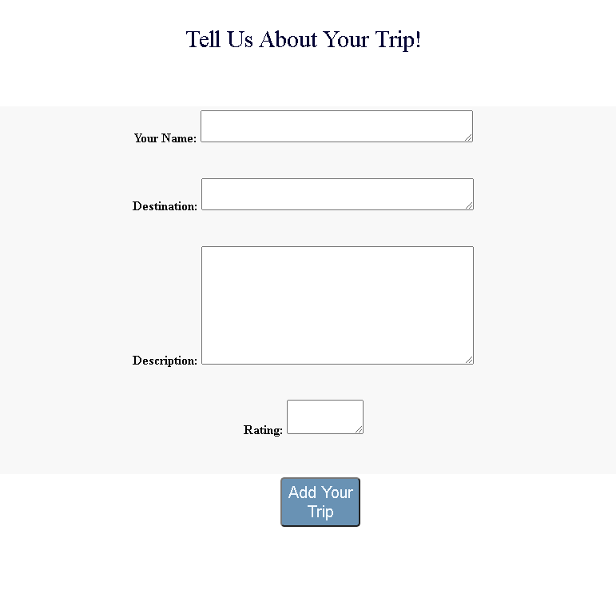

# Tripper

A collaborative travel blog where users can contribute their adventures to a shared platform.

## Description

As avid travelers, we at the Tripper team, wanted to come up with a solution to centralize the process of destination narrowing when planning a trip. Users leave reviews of activities and stays. This is an integrated platform for the professional traveler. It is an all-in-one travel sharing venue. Tripper allows you to have the inside scoop on places you plan on visiting and/or leave bread crumbs for other travelers to follow or avoid.
---
## Tripper Website

<a href="https://tripper-db.herokuapp.com/" target="_blank">Visit the Tripper website!</a>

---
## Demo

Add a trip to our collaborative travel blog by clicking on the 'Add Trip' button at the top of the page. You will be taken to our Add Trip form (displayed below) where you will be asked to give your name, destination, description, and rating of your trip. 

---

## Technologies Used

This platform was built using the following technologies

> Node.js, Express, Handlebars, MySQL, Sequlize ORM, Heroku, ClearDB, Passport, and Pexels API

---
## Licenses & Copyrights

MIT License

Copyright (c) 2021 Russell Jewett, Angelee Shaw, Wilkinson Williams, Josh Broughton

---
## Contributors

### <a href="https://github.com/treyjewett" target="_blank">Russell Jewett</a>

### <a href="https://github.com/angeleefshaw" target="_blank">Angelee Shaw</a>

### <a href="https://github.com/Kingcoopa" target="_blank">Wilkinson Williams</a>

### <a href="https://github.com/Jbrough0" target="_blank">Josh Broughton</a>
----

##### You are tripping if you are not using Tripper!
